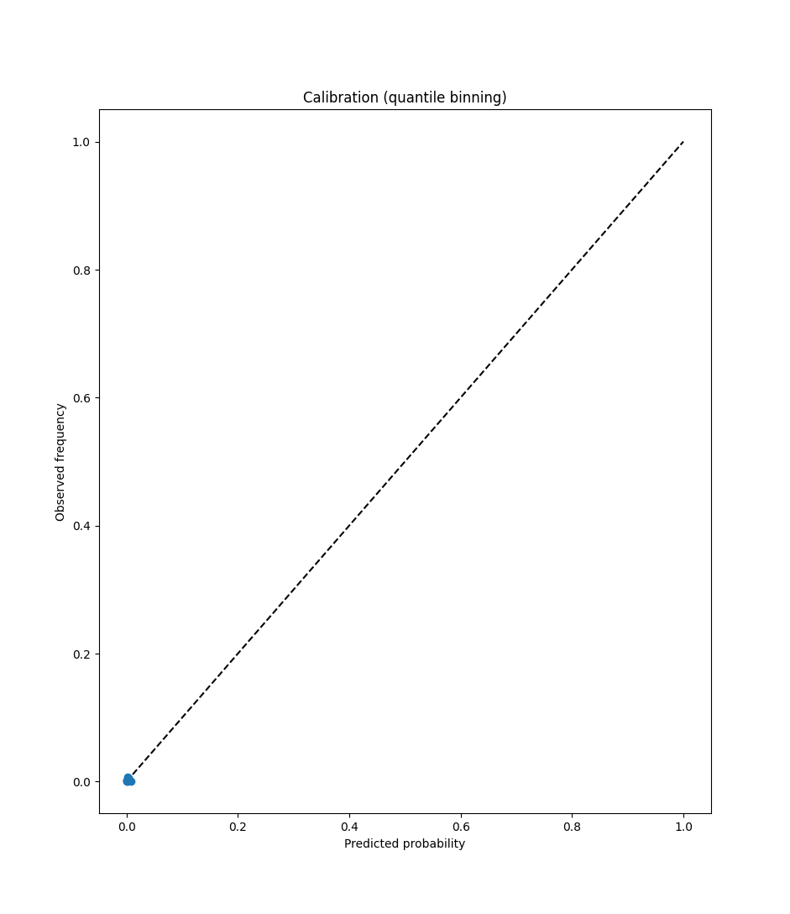
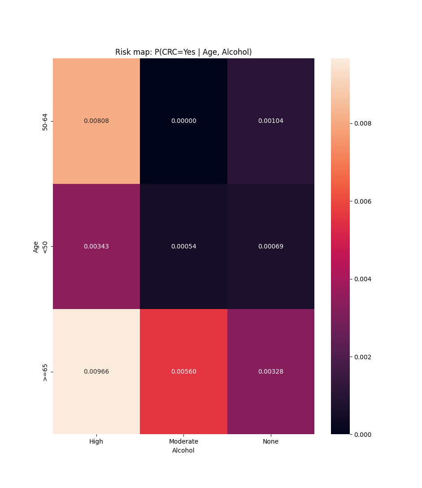
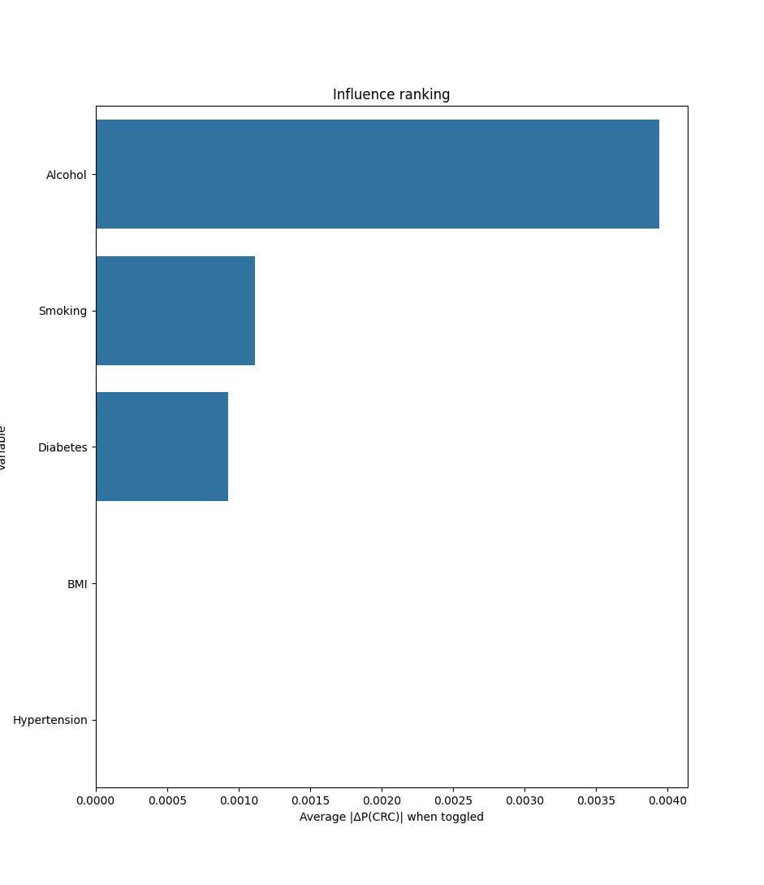

# Bayesian Networks for Colorectal Cancer Risk Prediction

A modular implementation of Bayesian networks for colorectal cancer risk mapping, featuring expert-guided structure learning, temporal parameter updating, and comprehensive model evaluation.

## Installation

This project uses [uv](https://github.com/astral-sh/uv) for dependency management.

```bash
uv sync
```

## Usage

Run the complete pipeline:

```bash
uv run python main.py
```

## Results

| Model Calibration | Risk Mapping | Variable Influence Analysis |
|:------------:|:-----------------:|:---------------------------:|
|  |  |  |

## Project Structure

- **`config.py`** - Configuration constants and expert constraints
- **`data_generator.py`** - Synthetic dataset generation
- **`structure_learning.py`** - Bayesian network structure learning
- **`parameter_estimation.py`** - Parameter estimation with priors
- **`temporal_updating.py`** - Temporal model updating
- **`prediction.py`** - Model evaluation and metrics
- **`calibration.py`** - Model calibration analysis
- **`visualization.py`** - Risk mapping and visualization
- **`influence_analysis.py`** - Variable influence analysis
- **`main.py`** - Pipeline orchestration
